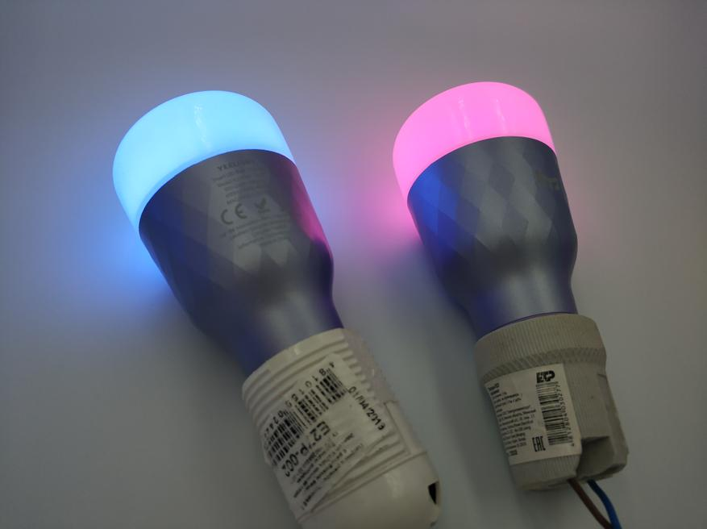
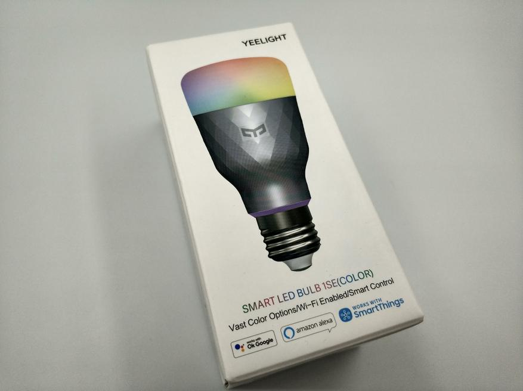
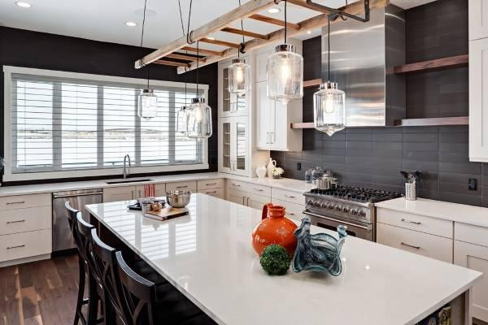
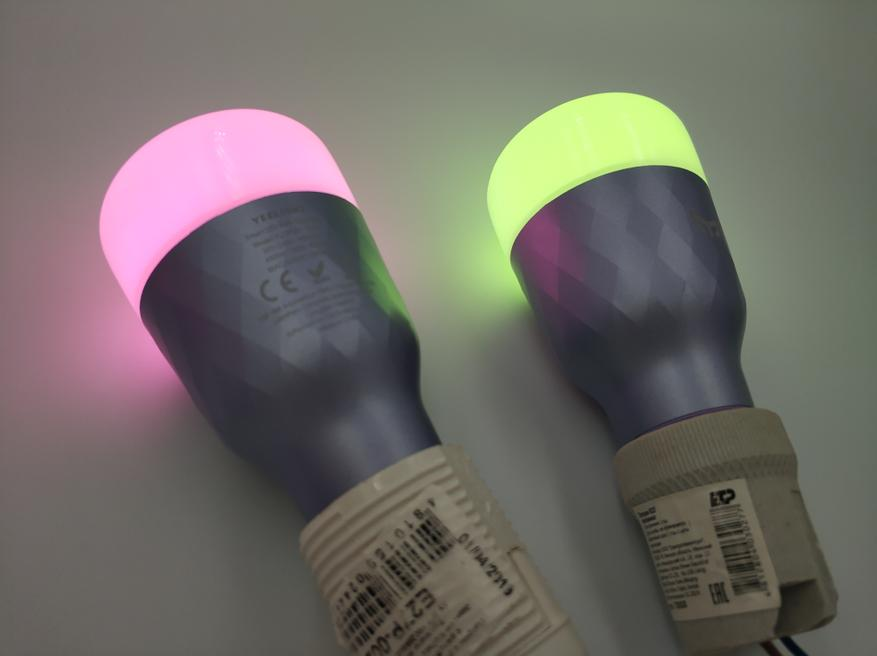

# Yeelight 1SE wirelessly controlled light bulb and Home Assistant connection

A quick overview of the Yeelight 1SE bulbs. The bulbs are decorative, only 6W, support RGB colors. Wireless control via WiFi, you can use either the official Yeelight app, which by the way does not slow down, unlike the same MiHome, or any third-party application - in my case it will be a smart home server Home Assistant.

## Introduction

I personally do not see the point of automating the main lighting in the house, it is not convenient for me. For example my wife likes to have a lot of light and always turn on the main light, while I, on the contrary, like to use the main light only when there is not enough decorative light or I have to do something that requires visual concentration. I'm more in favor of automation of decorative lights (such as LED lighting in the kitchen or bedroom), or where it is desirable: turning on the light in the closet on the motion sensor.

### The Yeelight difference

Yeelight has already released a huge number of bulbs that look very similar. The ones that are easiest to confuse are the Yeelight 1S, 1SE, 1S (Dimmable). As you can see from the photo below, the main difference between the 1S and 1SE is the 8.5W power versus 6W, but the other indicators are identical. Externally, they can be distinguished only by the color of the case: the 1SE is gray (even more likely light purple). 1S and 1S (Dimmable) do not differ at all externally. The difference is that the 1S is colored, and the Dimmable version is warm color only (the power is identical).

#### Usage options

I personally like to use these lamps in hanging open plafonds above my desk/work area, etc. The bulb itself looks good, a light purple shimmering body. Definitely won't ruin the look.

##### Yeelight standard app.
I really like the stability of this app. Compared to the MiHome glitches, it's heavenly. It's worth noting the large variety of colors: 16 million. The colors are very flexible. 
The standard app supports the grouping of bulbs, which allows you to change the color and brightness (and other parameters) of an entire group of bulbs at once. When you turn off, all settings are saved. The 6W bulb is considered analogous to a 45W incandescent bulb. Generally, I'm not a big fan of LED bulbs for basic lighting, nothing compares to the old classics as three hundred hundred incandescent or five at 60W. No LED bulb creates that kind of lamplight warmth. I still have the main light in my bedroom on incandescent bulbs and it doesn't matter how much electricity it takes.

###### Conclusion
The bulbs are not very powerful, will only go for decorations. It might make sense to use the more powerful 1S. I liked the variety of colors and settings, connect to Home Assistant, a lot of work has been done to integrate all kinds of bulbs.

